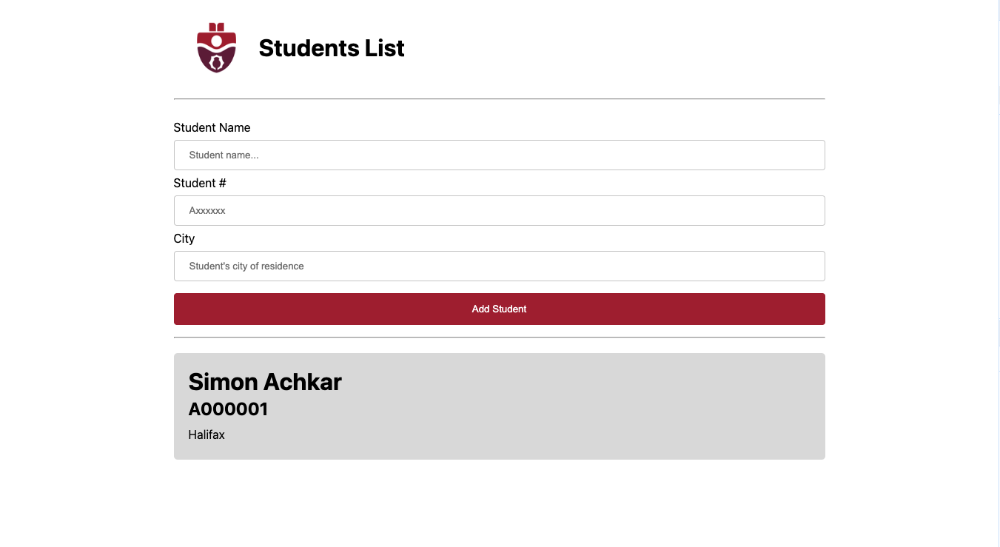

# IndexedDB

This app showcases the use of **IndexedDB**, a powerful tool for storing data in modern web browsers. It features a student list management system, utilizing the capabilities of IndexedDB to store and retrieve student data.

## Key Features of IndexedDB

- **Transactional Key-Value Database**: IndexedDB operates as a transactional database in the browser. If one action in a transaction fails, none of the actions in that transaction are applied.
- **Unstructured Data Storage**: Capable of storing a significant amount of unstructured data, including files and blobs.
- **Asynchronous Access**: IndexedDB can be accessed asynchronously, making it suitable for use in service workers for enhanced PWA (Progressive Web App) functionalities.

## Application Overview

- The app is set up as a Progressive Web App, complete with service worker registration for offline support and faster load times.
- Dynamically displays a list of students, allowing users to add new students through a simple form. The student data is immediately saved to IndexedDB and displayed on the page.
- Uses [`Dexie.js`](https://dexie.org/)for easy and efficient interaction with IndexedDB.

## Running the Application

1. **Installation**:

   - Run `npm i` or `npm install` to install the necessary packages.

2. **Starting the App**:
   - Execute `npm run start` to launch the app using [`http-server`](https://github.com/http-party/http-server#readme).

## Important Note

- **Unique Student IDs:** When entering student data, be aware that the "Student #" is used as the unique `id` in the IndexedDB. If two students are entered with the same "Student #", the existing student data will be overwritten.
